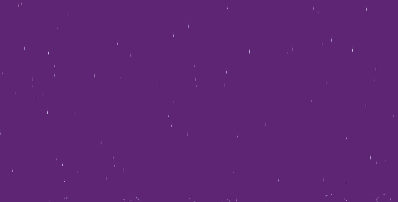

# Rain

Just a classic Javascript rain...

See it in action here: [mudroljub.github.io/rain.js/](http://mudroljub.github.io/rain.js/)

## Start

just open `index.html`

## Todo:
* odstupanja od konstante brzine
* noć i munje?
